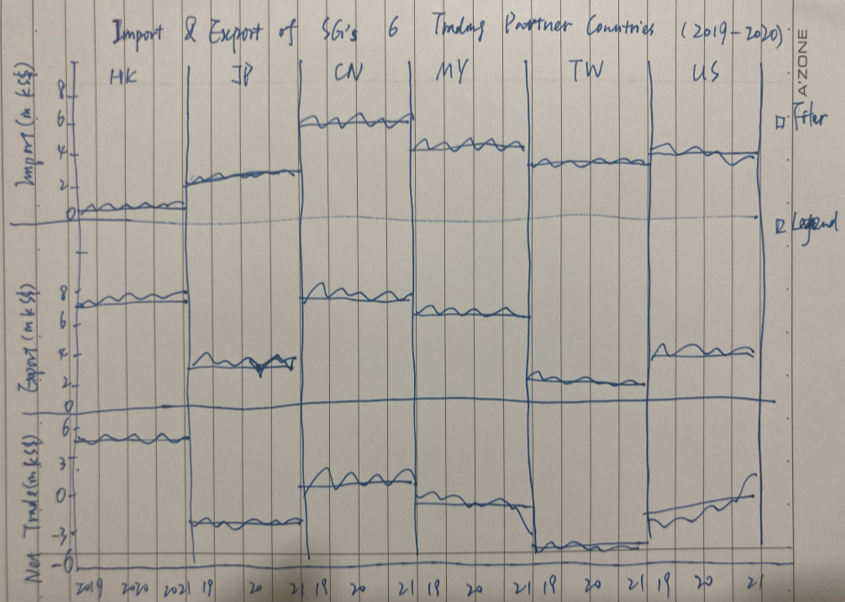
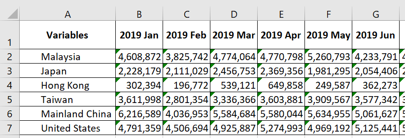
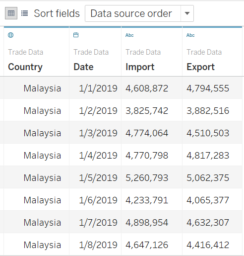
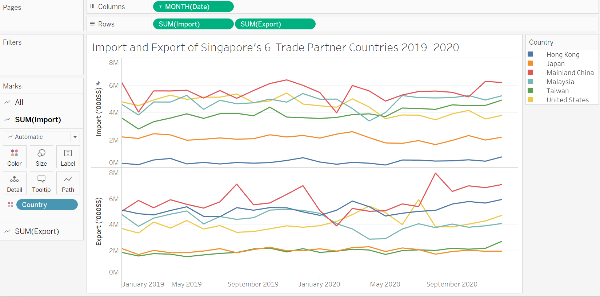
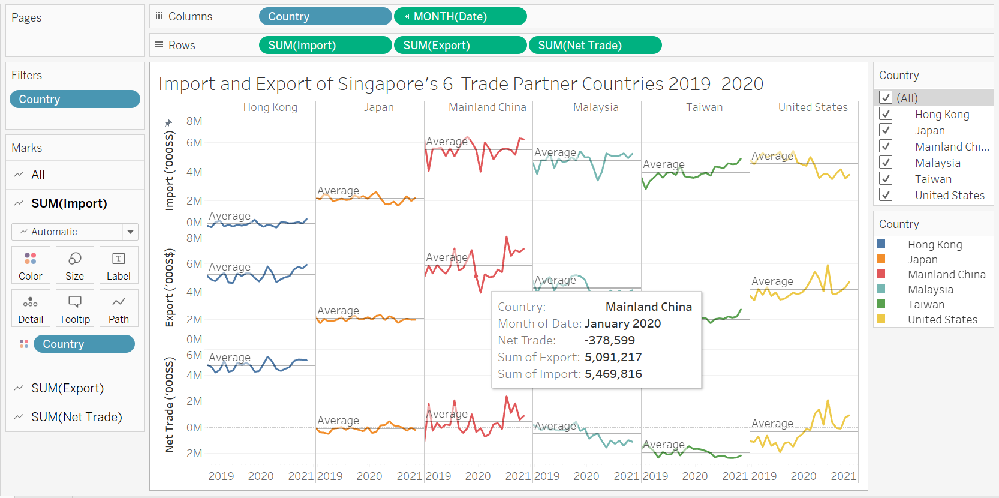

```{r setup, include=FALSE}
knitr::opts_chunk$set(echo = FALSE)
```

# 1.0 The Original Visualization

The original visualisation can be seen below : 


## 2.1 Clarity

### 1. Inaccurate graph title 
For Hong Kong, Mainland China, Malaysia, Taiwan and US, the graphs have indicated the Import and Export data from 2019 to 2021. Whereas for Japan, the graph only covers trades from 2019 and 2020. Therefore, using the title "2019-2020" is not accurate. 

### 2. Inconsistent y-axis ranges
The y-axis on the left and on the right represent Export and Import data respectively. However, the scale of these two axes are not synchronized. As a result, the graphs showing can not be used for comparison. In addition, the scale of y-axis of each country is consistent which make it impossible to conduct comparison among these countries. 

### 3. Incorrect dataset selected 
By checking the data source, the selected countries are not the top 6 countries in term of trading amounts, e.g. Indonesia has higher export amount than Taiwan and Japan. 

### 4. Improper type of chart 
Area charts were chosen in this visualization. However, it's not the best choice of chart type to show the development of trading volumes over time as area chart works best for displaying multiple values over a period of time for considerably large differences between the values. The overlapping areas make it hard to see the moving trends of the tradeing values. 

### 5. Lack of clear labeling 
There's no labeling of y-axis unit in all 6 graphs. 

## 2.2 Aesthetic

### 1. Selection of colors 
The two colors selected do not show the contrast clearly 

### 2. Multiple graphs 
Using individual graph for each country does not really point out the difference in the trade volumes directly.

### 3. Legend 
The legends are not well-defined in the graph. 

### 4. Data source
There's no mention of data source in this graph. 

# 3.0 Proposed Visualisation


# 4.0 Step-by-step Guide

## 4.1 Data Preparation

### Step 1 Delete unecessary data and only keep the 2019 and 2020 data belong to the 6 countries for both Import and Export :  


### Step 2 Import data to Tableau : 


### Step 3 Select the data and set up the graph. Change the title, include the filter and add the legend and reference line : 


### Step 4 Create the Net Trade formula and add it to the graph : 


# 5.0 Observations

## 5.1 Hong Kong
Hong Kong is Singapore's biggest export country among the six. 

## 5.2 Japan
There's not much variation in term of the trading amount between Singapore and Japan in the past 2 years.

## 5.3 Mainland China
Mainland China has the most trading volume with Singapore in both Import and Export. 

## 5.4 Malaysia
The net trade between Singapore and Malaysia dropped significantly in 2020. Mostly due to the impact of Covid-19.  

## 5.5 United States
Trades between Singapore and United States is switching from deficit to surplus overall (Export > Import).

## 5.6 Taiwan
Taiwan has the greatest trade deficits (Export < Import) with Singapore. It is also the smallest trading partner among the six countries. 

