```{r setup, include=FALSE}
knitr::opts_chunk$set(echo = FALSE)
```

# 1. The Original Visualization
For this DataViz Makeover assignment, data was downloaded from  Department of Statistics, Singapore (DOS). The graph below shows Singapore's 10 major merchandise trading partners. 


# 2. Critiques and suggestions for current visualisation

## 2.1 Clarity

### 1. No Graph Title
There's no title to indicate the content of the original graph. As a viewer, it's not clear to find out what is this graph about or what is the purpose and key points of showing this graph. 

### 2. Missing Proper Labels for Axes
There's no title or unit labeled in the original graph for both x- and y- axes. Viewers can not tell the x- and y- axes represent the amount for Export and Import, whether it's in Singapore dollar or in percentage. In addition, there's no tick marks on both x- and y- axes. Viewers have to eye-ball to locate the import and export amount which is not accurate. Furthermore, viewers are not able to tell whether the scale of x- and y- axes are synchronized. 

### 3. Overlapping Shapes
In the original graph, the location of each bubble is determined by the Import and Export amount of the particular trading partner. And therefore indicates whether it's a net importer or exporter by checking the bubble lies on the blue or green region in the graph. However, as the shapes are all in solid form and many are overlapping with each other, the center points of some bubbles are not shown but covered by others instead. Viewers can not tell the exact positions of the center points and thus they are neither able to see which region the bubbles fall in nor determine the corresponding country / region is net importer or exporter. 

### 4. Confusing Bubble Size  
The size of each circle is determined by the sum of import and export amount of respective trading partner which is the sum of the values on x-axis and y-axis. This is not straight forward for hte audience to understand. 

### 5. Unclear Top Net Importer / Exporter
It's not clear how Top Net Importer (Taiwan) and Top Net Exporter (Hong Kong) are determined. Viewers are not sure the calculation is based on the difference of import and export amount or the percentage of import / export volume compared with the total amount. 

### 6. Missing Legends
There's no legends shown in the original graph to tell the viewers what are the colors used to represent different counties / regions respectively. Also, the background colors of import and export are not explained. The usage of top net importer and exporter icons are placed way below the graph which is not helpful for viewer to understand. 

### 7. Unable to Show Changes in Trade Over Time
The original graph failed to indicate the changes of Singapore's 10 major merchandise trading partners over the years. Instead, it shows the import and export trades with these partners in 2020 only. 

## 2.2 Aesthetic

### 1. Poor Color Choice
The colors chosen for the bubbles in the orginal graph are not contrast with each other sufficiently. Using blue and green to differentiate import and export are not sufficiently significant as the background of the webpage is also in light blue. To make the graph more viewer-friendly and easy to understand, both colors should be avoided. 

### 2. Poor Transparency 
Solid circles should be avoided to prevent overlapping bubbles. The transparency of the shapes should be adjusted in order for viewers to see the center points of each bubble and therefore be able determine the position. 

### 3. Misleading Labels
The purpose of displaying the labels of each trading partner next to the corresponding bubble is to indicate the net trading amount and the particular country / region name. However, some labels are not aligned with the bubbles but away from them. Viewers may mistakenly read the numbers and names wrongly. Moreover, some labels are lying on the bubbles of other countries / regions and covering their center points. This makes the graph difficult to read. Using tooltip will be more suitable for this case to avoid making the graph too crowded and to highlight additional key information. 

# 3. Alternative Design 

The proposed design is shown as below : 

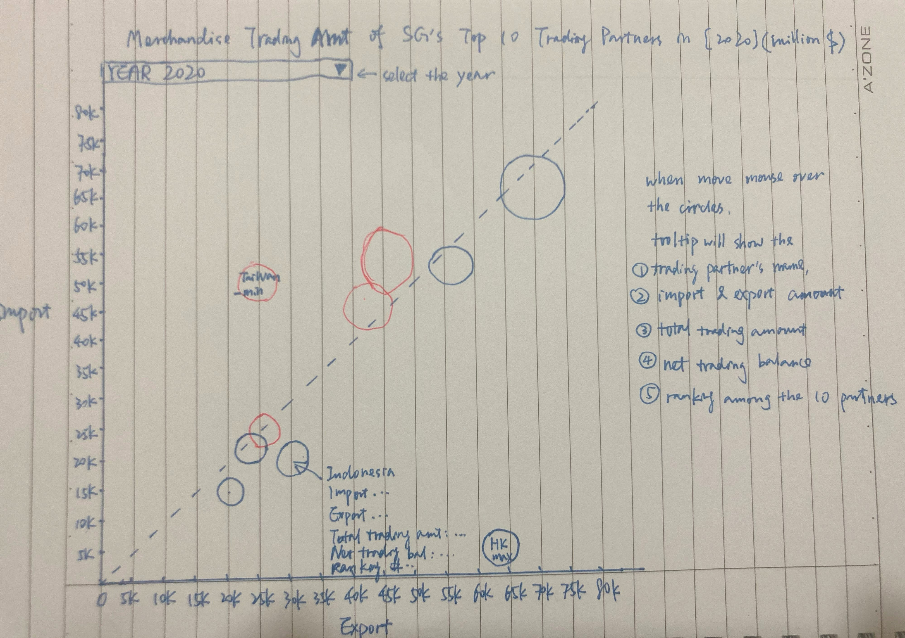

## 3.1 Clarity 

1. Title is given to illustrate the purpose of showing this graph. 
2. Axes labels and unit labels as well as tick marks are provided to help viewer understand the figures indicated in the graph. 
3. The use of contrast colors for the circles and reference line on a clear background can help the viewer identify the differences. 
4. Instead of showing 2020 trading amount only, a range from 2011 to 2020 are provided for viewers to better understand the changes over the years upon their selection. tradn
5. Country / region with the minimum (ranked 10th in net trading balance among the 10 partners) and maximum (ranked 1st) trading balances are labeled to highlight to the viewers as top importer and top exporter. `    

## 3.2 Aesthetic

1. Removed additional icons and wordings but use tooltip to highlight the key information when mouse over to avoid the messiness. 
2. White border and 80% opacity are applied to avoid overlapping issue. 
3. Simple colors "red" and "blue" are used to indicate the trading balances to improve the tidiness of the graph.  

# 4. Proposed Visualisation

The interactive visualization can be found on [Tableau Public](https://public.tableau.com/app/profile/lang.shuang.lesley/viz/Book1_16246636508970/BubbleChart).

# 5. Step-By-Step Guide

## 5.1 Data Preparation

### Step 1 
Remove the content sheet and only keep the data from Jan 2011 to Dec 2020 for the 10 trading partners : EU, Hong Kong, Indonesia, Japan, Mainland China, Malaysia, Republic of Korea, Taiwan, Thailand and United States.


### Step 2

The unit for EU is in million dollars whereas the rests are in thousand dollars. To standardize the unit and make it comparable, use million dollars as the only unit by dividing 1000 for the rest of 9 trading partners and only keep 2 decimals then save the cleaned spreadsheet. 

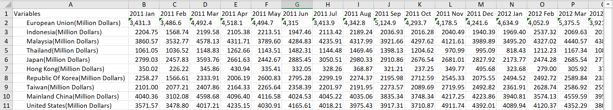


### Step 3

Open the spreadsheet in Tableau and drag "Imports" in the main pane. Select the second column (2011 Jan), press "Shift" button on the keyboard. Then move to the last column (2020 Dec) and select it. Right-click on the mouse and select "Pivot" from the list. Two new Pivot Fields columns are formed representing the month year and trading amount. Rename them to "Time" and "Import Amount". 

{ width=50% }

### Step 4

Select the first column "Variables", right-click on the mouse and select "Split". A new column is formed with the partners' names only. 

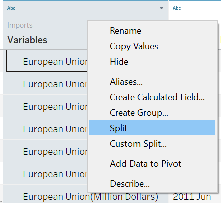{ width=30% }

Rename the new column to "Trading Partners" and hide the original one. 

{ width=70% }

### Step 5

Set the "Time" and "Import Amount" columns into "Date" and "Number(Decimal)" formats respectively. Copy the 3 columns into a new Excel spreadsheet. 

{ width=50% } 
{ width=50% }


### Step 6

Repeat Step 3 to Step 5 for "Exports". Copy the 3 columns into the same Excel spreadsheet with Import data. Remove repeated columns and only keep "Trading Partners", "Time" and "Import Amount" & "Export Amount".

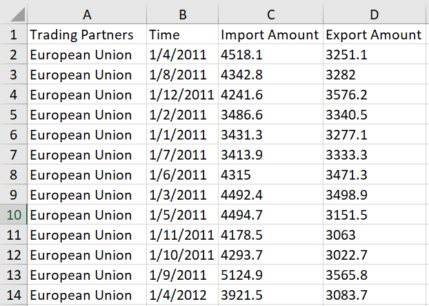{ width=50% }

### Step 7

Open the spreadsheet containing the new dataset in Tableau and make sure all data formats are correct then enter the working Sheet. 

{ width=40% }

### Step 8 

Drag ‘Export Amount’ to “Columns” and ‘Import Amount’ to “Rows”.

{ width=50% }

### Step 9

Go to "Analysis" on the top menu bar and select "Create Calculated Field".  

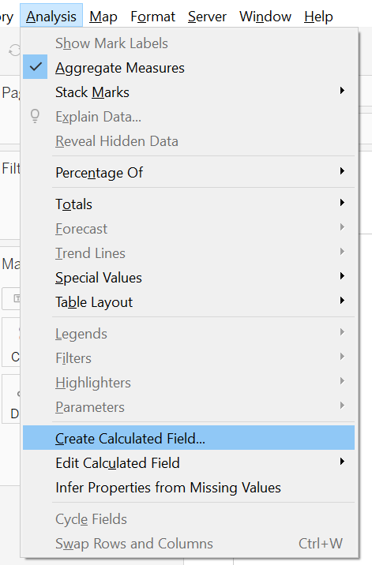{ width=30% }

Create "Total Trading Amount" by adding "Import Amount" and "Export Amount" together. 

{ width=50% }

Create "Net Trading Balance" by using "Export Amount" to minus "Import Amount". 

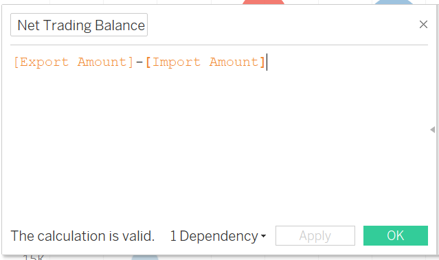{ width=50% }

### Step 10

In the "Marks" pane, drag "Total Trade Amount" into "Size", "Net Trading Balance" into “Color” and "Trading Partners" into "Detail". Select "Circle" from "Shape" and adjust the "Size" of the circles. 

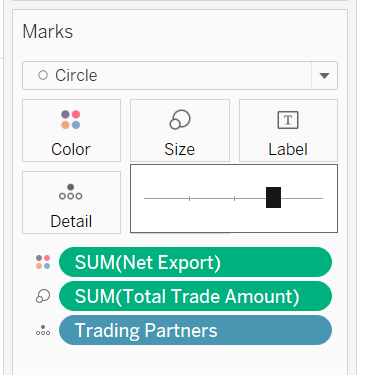{ width=30% }

Under "Color" settings, change “Opacity” to 80% and “Border” to white color to avoid occlusion and make sure viewers are able to identify the borders. 

### Step 11 

Select "Edit Colors" option upon clicking "Net Trading Balance" dropdown list. 

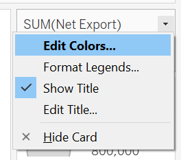{ width=20% }

Select "Red-Blue Diverging" from the "Palette" dropdown list and select "Use Full Color Range" checkbox to ensure the color contrasts. Click on the "Advanced" button and select “Center” and set as “0”. 

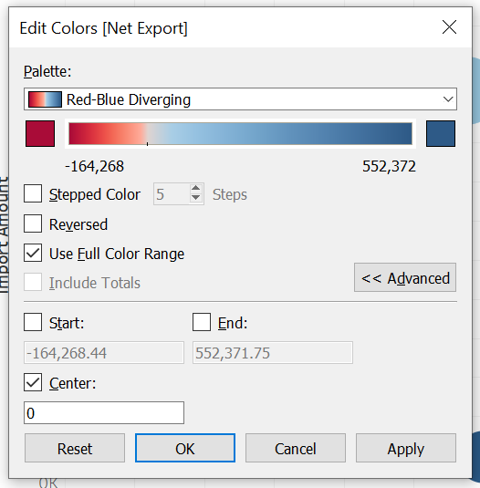{ width=40% }

Therefore, if the Net Export amount is positive, the circle will be shown in blue color. Otherwise, the circle will be shown in red, which means the import amount is larger than export.  

### Step 12 

Drag "Trading Partners" and "Net Trading Balance" to "Label" under Mart Pane. Click on "Label" to edit "Alignment". Select "Center" for "Horizontal" and "Middle" for "Vertical". Select "Min/Max" for "Marks to Label" and select "Sum(Net Trading Balance)" from "Field" dropdown list. Tick the checkbox for "Label minimum value" and Label maximum value".

{ width=30% }

### Step 13 

Drag "Time" to "Filters" pane and select "Years" as to be the parameter to be filtered on. 

{ width=30% }

Select "All" the years in the list and click on "OK". 

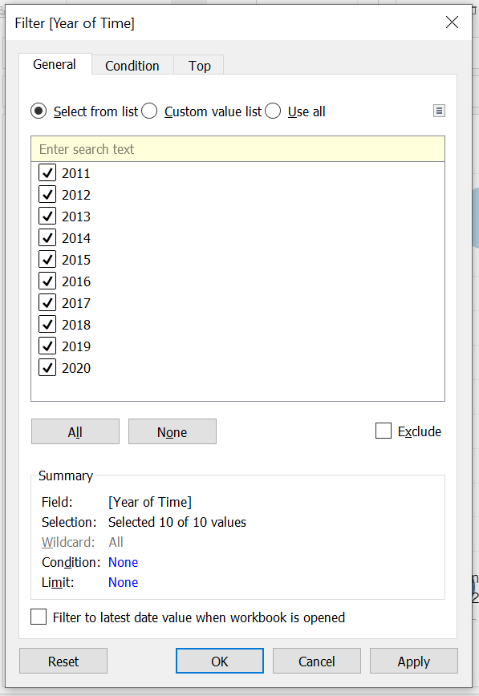{ width=40% }

Select "Show Filter" from the dropdown list so that "Years" is shown on the right-hand-side as the filter. 

{ width=30% }

Select "Single Value (list)" from the dropdown list of Year(Time) filter and untick "Show "All" Value". 

{ width=40% }

### Step 14 
Go to "Analysis" "Create Calculated Field" to create a new parameter "Reference Line". 

{ width=50% }

Drag it to the "Rows" and make it a second axis. Right-click and select "Synchronize Axis" 

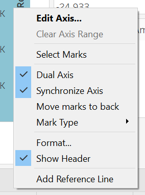{ width=30% }

Right-click on the graph and select "Trend Lines" and choose"Show Trend Lines" and tick "SUM(Reference Line)".

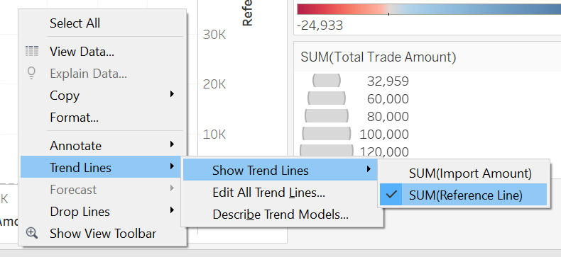{ width=50% }

Right-click on the trending line and select "Format" and choose the dotted line. 

{ width=30% }

In the Mark Pane of "SUM(Reference Line)", remove tooltip and labels and choose "Opacity" as "0". 

{ width=30% }

Go to y-axis and uncheck "Show Header". 

{ width=25% }


### Step 15 
Create two new parameters, "Net Import" and "Net Export" for the tooltip display. 

{ width=50% }
{ width=50% }

Create a new calculation field "Net Trade Ranking".

{ width=50% }

Left-click Tooltip in "Mark Pane", update the Tooltip fields to show trade deficit in red and surplus in blue. Add "Net Trade Ranking" to tooltip as well, select "Trading Partners" as "Compute Using".

{ width=40% }

### Step 16 
Arrange the wordings and edit in the Tooltip textbox : 

{ width=50% }

### Step 17 
Add a graph title and select to insert "YEAR(Time)" : 

{ width=50% }

### Step 18 
Move the YEAR(Time) filter above the graph and hide other legends. 

Filter.PNG){ width=75% }

The completed graph looks like below : 

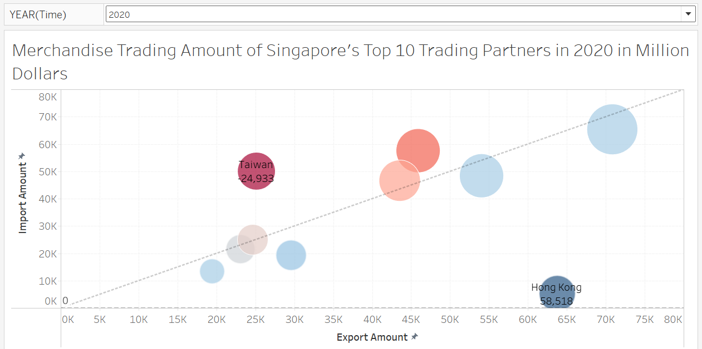{ width=75% }

# 6. Observations

## EU 
EU has always been a net importer to Singapore over the past 10 years. However, the import and export volume are getting closer and the overall trade balance are becoming more neutral.  

## Hong Kong 
Hong Kong has always been the top exporter a.k.a. ranked number 1 in the net trading balace of Singapore over the past 10 years. The floating range of net trading balance is quite stable which is within the range of 51k to 61k (million dollars). Over the years it maintains a growing trend gradually over the years except for 2019 which might caused by the social instability in Hong Kong. 

## Japan & Republic of Korea
According to the graph, Singapore's net merchandise trading with these 2 countries are moving from trade deficit (2011 - 2016) towards trade balance (2016 - 2020). This might be due to the stable trading policies and economic stability. 


are quite balanced with these 2 partners as they all located near the diagonal reference line. 


## Indonesia 
Th net trading volume between Indonesia and Singapore has shrinked significantly in the past decade. The export to Indonesia has dropped from 57 in 2011 to 30 in 2020 (in billion dollars). In addition, the import from Indonesia to Singapore also decreased since 2015. As the fourth most populous nation, Indonesia's economy has been growing rapidly in recent years. The observations in merchandise trade between Singapore and Indonesia indicates that Indonesia is becoming more self-sufficient and depend less on foreign import. 

## Mainland China & Malaysia
Before 2013, Malaysia was Singapore's largest trading partner in terms of total trading amount. However, mainland China has taken over Malaysia and became the country with biggest trading volume with Singapore since 2013. The overall import and export amount of these two countries each account for about 10% of the overall trading volume in th epast decade. There's no doubt that these two countries are the most important trading partners of Singapore. 

## Taiwan 
Taiwan has always been a net importer to Singapore and became the largest importer to Singapore since 2018 though the export amount kept increasing over the years. 

## Thailand 
Merchandise trading between Singapore and Thailand has been quite stable over the years. Thailand as Singapore's smallest trading partner among the top 10 is always a net exporter to Singapore.  

## United States
United States used to be the top importer to Singapore before 2018. However, due to arising of the export amount to United States, the net trading balance between Singapore and United States has moved towards neutral since 2016 and become trade surplus in 2020.   

